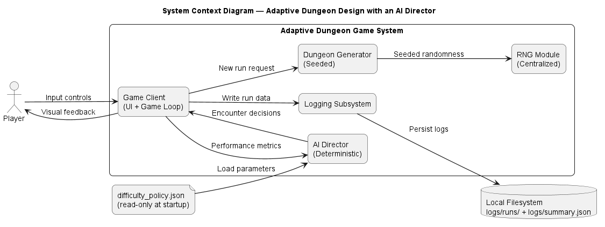
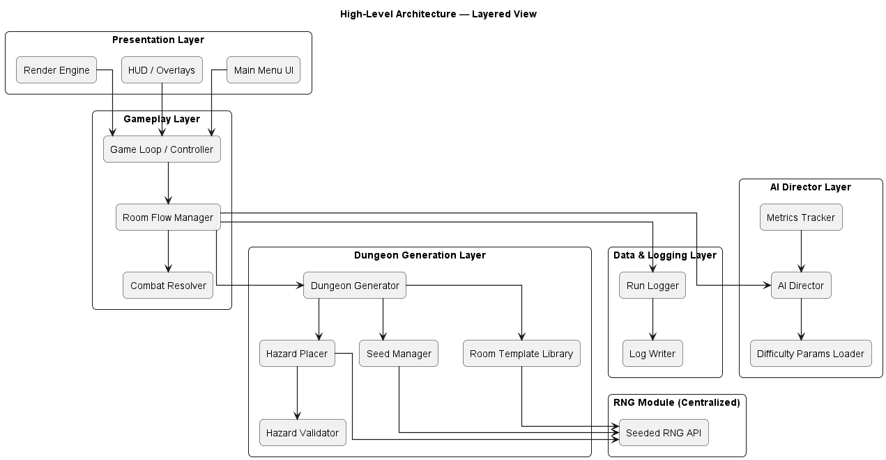
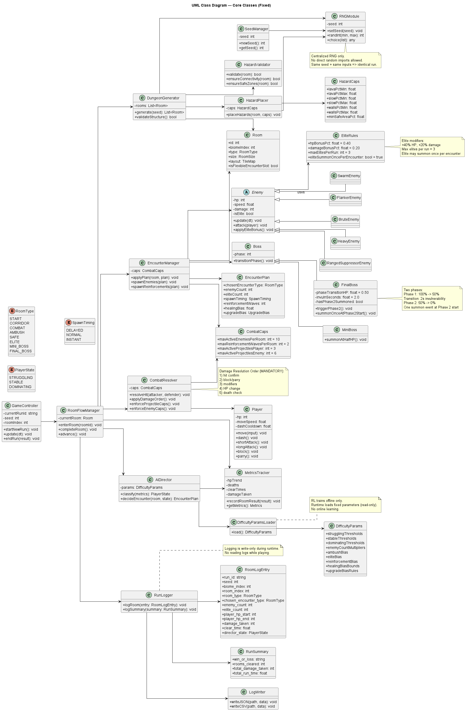
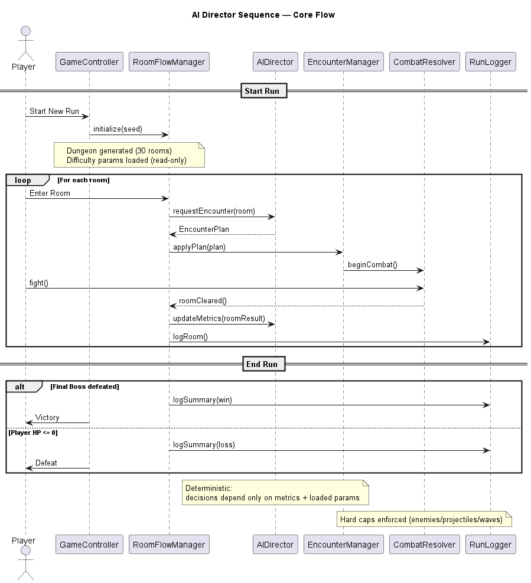

# Software Requirements Specification (SRS)  
# Adaptive Dungeon Design with an AI Director  

**Course:** Advanced Software Engineering Project  

**Group Members:**  
Natalie Cristina Leal Blanco  
Maham Asif  

**Date:** Feb-24-2026

# Table of Contents

1. Introduction  
   1.1 Purpose  
   1.2 Document Conventions  
   1.3 Intended Audience  
   1.4 Product Scope  
   1.5 Assumptions and Dependencies  
   1.6 Definitions, Acronyms, and Abbreviations  

2. Overall Description  
   2.1 Product Perspective  
   2.2 Product Functions  
   2.3 User Classes and Characteristics  
   2.4 Operating Environment  
   2.5 Design and Implementation Constraints  

3. External Interface Requirements  

4. System Features (Functional Requirements)  

5. Non-Functional Requirements  

6. Reinforcement Learning (Offline Parameter Tuning)  

7. System Design Models  

8. Verification and Validation  

9. Risk Analysis  

10. Requirements Traceability Matrix  

11. Optional Enhancements  

Appendices  

# 1. Introduction

## 1.1 Purpose

The purpose of this Software Requirements Specification (SRS) is to define the functional and non-functional requirements for the **Adaptive Dungeon Design with an AI Director** game system.

This document serves as a formal agreement between stakeholders and developers. It specifies system behavior, constraints, interfaces, and performance expectations in sufficient detail to enable implementation without additional design clarification.

The system is a procedurally generated dungeon-crawling game in which a deterministic AI Director dynamically adjusts encounter pacing and difficulty based on player performance. Reinforcement learning is used only during offline development to tune numerical parameters.

## 1.2 Document Conventions

The following conventions are used throughout this document:

- **Shall** indicates a mandatory requirement.
- **Should** indicates a recommended but non-mandatory requirement.
- **May** indicates an optional feature.

Functional requirements are labeled using the format:

Example: `R4.3.2`

Priorities are classified as:

- **Essential** – Required for core functionality.
- **Optional** – Enhances gameplay but not required.
- **Stretch** – Future enhancement beyond current scope.

## 1.3 Intended Audience

This document is intended for:

- **Developers and Designers** – Responsible for implementing gameplay systems, procedural generation, and AI Director logic.
- **Testers and Evaluators** – Responsible for validating requirement compliance.
- **Instructors and Reviewers** – Responsible for assessing technical completeness and design rigor.

Suggested reading order:

- All readers: Sections 1 and 2.
- Developers: Sections 3, 4, 5, and 6.
- Testers: Sections 4, 5, and 8.

## 1.4 Product Scope

Adaptive Dungeon Design with an AI Director is a single-player, top-down 2D dungeon crawler with roguelike structure.

Each game session consists of:

- A fixed-length dungeon run of **exactly 30 rooms**
- Divided into **4 predefined biomes**
- Mini-boss encounters at biome ends
- A final boss encounter at room 29

The core design principle:

- The **Seed** controls bounded encounter variation, while room dimensions, milestone positions, and biome structure remain fixed.
- The **AI Director** controls pacing and difficulty.
- **Reinforcement Learning** tunes parameters offline only.
- Runtime gameplay remains deterministic.

### In-Scope

- Procedural dungeon generation with controlled variation
- Biome-based hazard constraints
- Deterministic AI Director difficulty adjustment
- Defined player combat mechanics
- Enemy archetype system
- Boss phase mechanics
- Run-based logging for offline analysis

### Out-of-Scope

- Multiplayer functionality
- Online or real-time machine learning
- Meta-progression systems
- Persistent player upgrades across runs
- Dynamic lighting engines
- Isometric perspective rendering

## 1.5 Assumptions and Dependencies

The following assumptions apply:

- The game runs on a personal computer (PC).
- The system uses a centralized seeded random number generator.
- Deterministic execution is strictly enforced.
- The project is developed within a semester-long academic timeline.
- No external online services are required for gameplay.

Dependencies include:

- A 2D rendering engine capable of real-time updates.
- File-based configuration for difficulty parameters.
- Local file storage for run logging.

## 1.6 Definitions, Acronyms, and Abbreviations

**AI Director** – A high-level control system that monitors player performance and deterministically adjusts encounter pacing.

**Procedural Generation** – Algorithmic generation of dungeon layouts using predefined rules and a seed.

**Seed** – A deterministic value used to generate bounded encounter variation, including flexible room-type selection and enemy spawn pattern selection.

**Roguelike** – A game structure featuring permadeath and run-based resets.

**Reinforcement Learning (RL)** – A machine learning method used offline to tune numerical difficulty parameters.

**Encounter** – Any combat or high-pressure room event.

**Biome** – A structured segment of the dungeon with distinct hazard caps and pacing characteristics.

# 2. Overall Description

## 2.1 Product Perspective

The Adaptive Dungeon Design system is a standalone single-player game application composed of interacting subsystems:

- Dungeon Generation System
- Hazard and Geometry Validation System
- AI Director System
- Enemy System
- Player Combat System
- Logging System
- Rendering Layer

The AI Director operates as a meta-layer above gameplay systems. It does not control enemy AI directly. Instead, it adjusts encounter configuration parameters within predefined bounds.

The rendering layer is strictly separated from gameplay logic.

## 2.2 Product Functions

At a high level, the system performs the following sequence:

1. Generate dungeon using a single global seed.
2. Validate room geometry and hazard constraints.
3. Begin player progression through rooms.
4. AI Director monitors performance metrics.
5. AI Director adjusts upcoming encounters.
6. Repeat until victory or defeat.
7. Log run data for offline analysis.

The dungeon structure remains fixed in length and milestone placement across all runs.

## 2.3 User Classes and Characteristics

### Primary User: Player

- Controls a single character.
- Navigates dungeon rooms sequentially.
- Engages in combat encounters.
- Makes upgrade decisions in safe rooms.

The system assumes:

- Basic familiarity with action games.
- No prior knowledge of AI Director behavior.
- Variable skill levels, handled by adaptive pacing.

No administrative or multi-role users are supported.

## 2.4 Operating Environment

The system shall operate under the following conditions:

- Platform: Personal Computer (PC)
- Operating System: Windows or macOS
- Input Devices: Keyboard and mouse
- Rendering: 2D top-down perspective
- Graphics Style: Tile-based pixel art
- Tile Size: 32×32
- Runtime: Real-time game loop environment

The system shall not require internet connectivity.

## 2.5 Design and Implementation Constraints

The system shall adhere to the following constraints:

- Exactly 30 rooms per run.
- Exactly 4 biomes.
- Room 0 is always Start.
- Room 29 is always Final Boss.
- Biome boundaries are fixed.
- AI Director must remain deterministic.
- Reinforcement learning must occur offline only.
- All randomness must originate from a centralized RNG module.
- No module may import uncontrolled random functions.
- Rendering logic must remain separate from gameplay logic.

# 3. External Interface Requirements

## 3.1 User Interfaces

The system shall provide a consistent 2D top-down interface throughout gameplay.

### 3.1.1 Main Menu Interface

The Main Menu shall allow the player to:

- Start a new dungeon run
- Exit the application

**Requirements**

- R3.1.1 The system shall display a main menu upon launch.
- R3.1.2 The system shall allow the player to start a new run.
- R3.1.3 The system shall allow the player to exit the application.

### 3.1.2 In-Game Heads-Up Display (HUD)

The HUD shall provide real-time gameplay feedback.

Displayed elements:

- Current player health
- Current room index
- Biome indicator
- Combat state indicator

**Requirements**

- R3.2.1 The system shall display the player's current HP at all times during gameplay.
- R3.2.2 The system shall indicate active combat state.
- R3.2.3 The HUD shall update in real time without noticeable delay.

### 3.1.3 Dungeon Room Interface

Each room shall visually present:

- Floor layout
- Hazard tiles
- Enemy entities
- Entry and exit points

Room visuals may vary by biome theme.

**Requirements**

- R3.3.1 The system shall visually distinguish room types (combat, ambush, safe, boss).
- R3.3.2 The system shall prevent room exit until encounter completion.
- R3.3.3 The system shall visually indicate room completion.

### 3.1.4 Safe Room Interface

Safe rooms shall provide:

- Partial health restoration
- Upgrade selection (choose one)

**Requirements**

- R3.4.1 The system shall restore partial health in safe rooms.
- R3.4.2 The system shall present multiple upgrade options.
- R3.4.3 The player shall select exactly one upgrade.

### 3.1.5 End-of-Run Interface

Upon run completion or failure:

- Victory screen (boss defeated)
- Defeat screen (HP ≤ 0)

**Requirements**

- R3.5.1 The system shall display a victory screen after final boss defeat.
- R3.5.2 The system shall display a defeat screen when player HP reaches zero.
- R3.5.3 The system shall allow return to main menu.

## 3.2 Hardware Interfaces

The system shall support:

- Keyboard for movement and actions
- Mouse for directional input (if applicable)

**Requirements**

- R3.6.1 The system shall support keyboard movement controls.
- R3.6.2 The system shall support mouse input where applicable.
- R3.6.3 Gamepad support is optional.

## 3.3 Software Interfaces

### 3.3.1 AI Director Interface

The AI Director shall interface with:

- Player metrics module
- Encounter generation module
- Difficulty parameter loader

**Requirements**

- R3.7.1 The AI Director shall receive player performance metrics.
- R3.7.2 The AI Director shall output deterministic encounter decisions.
- R3.7.3 The AI Director shall not directly control enemy AI logic.

### 3.3.2 RNG Interface

All randomness must pass through a centralized seeded RNG module.

**Requirements**

- R3.8.1 The system shall use a single seeded RNG instance per run.
- R3.8.2 No module shall directly import uncontrolled random functions.
- R3.8.3 Identical seeds shall produce identical dungeon layouts.

### 3.3.3 Reinforcement Learning Parameter Interface

Offline-tuned parameters shall be loaded at runtime.

**Requirements**

- R3.9.1 The system shall load difficulty parameters from a configuration file at game start.
- R3.9.2 The system shall not modify difficulty parameters during gameplay.

### 3.3.4 Logging Interface

The system shall log gameplay data for offline analysis.

**Requirements**

- R3.10.1 The system shall record per-room metrics.
- R3.10.2 The system shall record end-of-run summary data.
- R3.10.3 Logging shall not influence runtime gameplay decisions.

# 4. System Features (Functional Requirements)

## 4.1 Procedural Dungeon Generation

**Priority:** Essential

The system shall generate a dungeon composed of exactly 30 rooms divided into four fixed biomes.

### 4.1.1 Fixed Structure

- R4.1.1 The system shall generate exactly 30 rooms per run.
- R4.1.2 The system shall divide the dungeon into 4 biomes.
- R4.1.3 Room 0 shall be the Start Room.
- R4.1.4 Room 29 shall be the Final Boss Room.
- R4.1.5 Each biome shall end with a mini boss (except final biome).

### 4.1.2 Room Types

Supported room types:

- Start
- Corridor / Transition
- Combat
- Ambush
- Safe / Rest
- Elite
- Mini Boss
- Final Boss

- R4.1.6 The system shall support all defined room types.
- R4.1.7 Room type distribution shall remain within biome-specific bounds.

### 4.1.3 Seed-Controlled Variation

The seed shall control:

Flexible encounter slots

Enemy spawn patterns

Deterministic encounter composition variation within predefined biome bounds

The seed shall not control:
Total room count
Milestone positions
Room sizes
Core room geometry
Hazard caps
Boss room structure

“The seed shall not modify total room count.”

“The seed shall not modify milestone positions.”

“The seed shall not override hazard caps.”

## 4.1.4 Seed-Controlled Room Distribution Constraints
### Overview
To ensure deterministic yet controlled procedural generation, the random seed SHALL only influence:
1. Room type assignment (within predefined bounds)
2. Enemy spawn patterns and compositions

The seed SHALL NOT influence:
- Room size
- Room grid dimensions
- Core room layout structure

All rooms must follow fixed structural rules, while allowing limited variation through seed-controlled selection.

---

### Fixed Global Constraints

The following rules apply across all biomes:

- Total number of rooms per biome is FIXED
- First room MUST always be:
  - `START`
- Last room MUST always be:
  - `MINI_BOSS` (Biome 1–3)
  - `FINAL_BOSS` (Biome 4)
- Each biome MUST contain exactly:
  - **1 SAFE room**
- Safe room CANNOT:
  - Appear as first room
  - Appear as last room
- Boss rooms are FIXED and NOT controlled by seed

---

### Room Type Distribution (Per Biome)

The seed SHALL select room types ONLY within the following predefined distributions.

---

#### Biome 1 (8 Rooms)

| Room Type   | Count | Fixed / Seed Controlled |
|------------|------|--------------------------|
| START      | 1    | Fixed (Room 0)           |
| MINI_BOSS  | 1    | Fixed (Last Room)        |
| SAFE       | 1    | Seed-controlled position |
| ELITE      | 1    | Seed-controlled          |
| AMBUSH     | 1    | Seed-controlled          |
| COMBAT     | 3    | Seed-controlled          |

👉 Seed behavior:
- Rooms 1–6 are shuffled deterministically using seed
- Distribution MUST remain constant

---

#### Biome 2

| Room Type   | Count |
|------------|------|
| START      | 1    |
| MINI_BOSS  | 1    |
| SAFE       | 1    |
| ELITE      | 1–2  |
| AMBUSH     | 1–2  |
| COMBAT     | Remaining |

👉 Safe room is exactly 1 and cannot move outside valid positions

---

#### Biome 3

| Room Type   | Count |
|------------|------|
| START      | 1    |
| MINI_BOSS  | 1    |
| SAFE       | 1    |
| ELITE      | 2    |
| AMBUSH     | 2    |
| COMBAT     | Remaining |

---

#### Biome 4 (Final Biome)

| Room Type   | Count |
|------------|------|
| START      | 1    |
| SAFE       | 1    |
| ELITE      | 2–3  |
| AMBUSH     | 2–3  |
| COMBAT     | Remaining |
| FINAL_BOSS | 1 (Fixed Last Room) |

---

### Safe Room Placement Rules

- Each biome MUST contain exactly one SAFE room
- Safe room MUST:
  - Appear only in mid-biome
  - Not be first or last room
- Recommended placement range:
  - Between 30%–60% of total rooms

Example:
- Biome 1 (8 rooms): Room 3 or 4

---

### Seed Responsibilities

The seed SHALL control:

1. Room ordering (within fixed distribution)
2. Enemy spawn composition (types and counts)
3. Enemy spawn positions
4. Hazard placement (lava, slow tiles)

---

### Non-Seed Responsibilities

The following MUST remain deterministic:

- Room size (grid dimensions)
- Room layout structure
- Door positions
- Boss room placement
- Safe room mechanics (healing, upgrades)

---

### Rationale

This design ensures:

- Deterministic replayability (same seed → same run)
- Controlled difficulty progression
- Prevention of invalid layouts
- Reduced procedural complexity

---

### Implementation Example (Biome 1)

Seed input:
SEED = 42

Fixed structure:
[START, ?, ?, ?, ?, ?, ?, MINI_BOSS]

Seed-controlled shuffle (within bounds):
[COMBAT, SAFE, COMBAT, ELITE, AMBUSH, COMBAT]

Final layout:
START → COMBAT → SAFE → COMBAT → ELITE → AMBUSH → COMBAT → MINI_BOSS

## 4.1.5 Seed-Controlled Room Distribution Constraints
#### Overview

Enemy spawning SHALL be constrained by both:

1. **Biome**
2. **Room type**

The seed MAY vary encounter composition and spawn realization only within predefined biome-specific limits.

The seed SHALL NOT:
- introduce unsupported enemy archetypes into a biome-room combination
- exceed biome-room enemy count limits
- alter boss phase logic
- alter fixed boss identity
- bypass fairness and spawn-safety constraints

This section defines the **allowed bounds** for seed-controlled enemy spawning.  
Current implementation profiles are valid examples within these bounds, but seed-controlled variation may choose lower or higher values as long as the defined limits are respected.

---

#### Global Spawn Rules

The following rules apply across all biomes:

- SAFE rooms SHALL contain **0 enemies**
- START rooms SHALL contain **0 hostile enemies**
- MINI_BOSS rooms SHALL contain exactly **1 mini boss** as the primary encounter
- FINAL_BOSS room SHALL contain exactly **1 final boss** as the primary encounter
- Non-boss encounter variation SHALL be controlled only within the biome-specific limits below
- Spawn timing, spawn positions, and allowed composition MAY vary by seed, but only within the limits defined here

---

#### Global Spawn Safety Constraints

All enemy spawns SHALL satisfy the following:

- Enemy spawn points must be inside the playable room area
- Enemy spawn points must not overlap blocked wall regions
- Enemy spawn points must maintain required separation from player spawn
- Enemy spawn points must maintain required separation from each other
- Spawn realization must remain deterministic for the same seed and room index

---

### Biome 1 Spawn Constraints

Supported non-boss enemy archetypes in Biome 1:
- Swarm
- Flanker
- Brute

Biome 1 seed-controlled encounter bounds:

| Room Type  | Allowed Enemy Count | Allowed Enemy Types | Elite Allowed | Allowed Spawn Patterns |
|-----------|---------------------|---------------------|---------------|------------------------|
| COMBAT    | 1–3                 | Swarm, Flanker, Brute | No          | Spread                 |
| AMBUSH    | 2–3                 | Swarm, Flanker, Brute | No          | Ambush                 |
| ELITE     | 2–3                 | Swarm, Flanker, Brute | Yes         | Triangle               |
| SAFE      | 0                   | None                | No            | None                   |
| MINI_BOSS | 1 primary boss      | MiniBoss only       | No            | Single                 |

Biome 1 notes:
- Seed MAY vary the exact combat composition within the allowed archetypes
- Seed MAY vary encounter size within the allowed range
- Seed SHALL NOT introduce Heavy or Ranged enemies in Biome 1 standard encounters

---

### Biome 2 Spawn Constraints

Supported non-boss enemy archetypes in Biome 2:
- Swarm
- Flanker
- Brute
- Heavy

Biome 2 seed-controlled encounter bounds:

| Room Type  | Allowed Enemy Count | Allowed Enemy Types | Elite Allowed | Allowed Spawn Patterns |
|-----------|---------------------|---------------------|---------------|------------------------|
| COMBAT    | 3–4                 | Swarm, Flanker, Brute, Heavy | No   | Spread                 |
| AMBUSH    | 2–3                 | Swarm, Flanker, Brute, Heavy | No   | Ambush                 |
| ELITE     | 2–3                 | Swarm, Brute, Heavy          | Yes  | Triangle               |
| SAFE      | 0                   | None                         | No   | None                   |
| MINI_BOSS | 1 primary boss + 0–4 scheduled adds | MiniBoss2 primary; Swarm, Flanker, Brute, Heavy adds | No | Single for boss; scheduled add spawns |

Biome 2 notes:
- Heavy becomes available beginning in Biome 2
- Seed MAY vary combat count between 3 and 4
- Seed MAY vary ambush count between 2 and 3
- Mini boss add schedule may be present only if explicitly supported by implementation rules

---

### Biome 3 Spawn Constraints

Supported non-boss enemy archetypes in Biome 3:
- Swarm
- Flanker
- Brute
- Heavy
- Ranged

Biome 3 seed-controlled encounter bounds:

| Room Type  | Allowed Enemy Count | Allowed Enemy Types | Elite Allowed | Allowed Spawn Patterns |
|-----------|---------------------|---------------------|---------------|------------------------|
| COMBAT    | 3–4                 | Swarm, Flanker, Brute, Heavy, Ranged | No | Spread |
| AMBUSH    | 3–4                 | Swarm, Flanker, Brute, Heavy, Ranged | No | Ambush |
| ELITE     | 2–3                 | Swarm, Brute, Heavy, Ranged          | Yes | Triangle |
| SAFE      | 0                   | None                                  | No  | None |
| MINI_BOSS | 1 primary boss + 0–3 phase-triggered adds | Biome3MiniBoss primary; Swarm/Flanker adds | No | Single for boss; ring-style adds |

Biome 3 notes:
- Ranged enemies become available beginning in Biome 3
- Current implementation uses 3–4 enemy standard encounters; the SRS bound should preserve that range
- Mini-boss reinforcement/adds SHALL remain phase-triggered, not freely randomized

---

### Biome 4 Spawn Constraints

Supported non-boss enemy archetypes in Biome 4:
- Swarm
- Flanker
- Brute
- Heavy
- Ranged

Biome 4 seed-controlled encounter bounds:

| Room Type   | Allowed Enemy Count | Allowed Enemy Types | Elite Allowed | Allowed Spawn Patterns |
|------------|---------------------|---------------------|---------------|------------------------|
| COMBAT     | 3–4                 | Swarm, Flanker, Brute, Heavy, Ranged | No | Spread |
| AMBUSH     | 3–4                 | Swarm, Flanker, Brute, Heavy, Ranged | No | Ambush |
| ELITE      | 2–3                 | Brute, Heavy, Ranged, Swarm          | Yes | Triangle |
| SAFE       | 0                   | None                                  | No  | None |
| FINAL_BOSS | 1 final boss + 0–3 bounded boss-triggered adds | FinalBoss primary; bounded adds only if boss logic supports them | No | Fixed boss encounter logic |

Biome 4 notes:
- Final boss identity and phase behavior are fixed
- Seed SHALL NOT replace the final boss or alter boss phase sequencing
- Standard non-boss encounters MAY vary within the count and archetype bounds above

---

### Seed-Controlled Variation Rules for Enemy Spawns

Within the biome-room limits defined above, the seed MAY control:

- exact enemy composition within the allowed pool
- enemy count within the allowed lower/upper bound
- spawn slot ordering
- spawn position realization
- ambush orientation / spread anchor / triangle anchor
- bounded scheduled add realization where supported by the encounter design

The seed SHALL NOT control:

- unsupported archetype introduction
- boss identity
- boss phase transition logic
- elite multiplier values
- room type legality
- safe room enemy presence

---

### Determinism Requirement

For the same:
- run seed
- biome index
- room index
- room type

the system SHALL produce the same spawn decision and spawn realization.

---

### Rationale

This design keeps spawn variation controlled and testable by:

- tying encounter bounds to biome progression
- preventing invalid enemy mixes
- allowing seed-based variation without chaos
- preserving fairness, determinism, and implementation compatibility

### 4.1.6 Enemy Spawn Constraints by Biome and Room Type

#### Overview

Enemy spawning SHALL be constrained by:
- Biome
- Room type

The seed MAY vary encounter composition ONLY within predefined biome-specific bounds.

---

## Biome 1 Spawn Constraints

### Allowed Bounds

| Room Type  | Allowed Enemy Count | Allowed Types              | Elite Allowed | Pattern   |
|-----------|---------------------|----------------------------|---------------|----------|
| COMBAT    | 1–3                 | Swarm, Flanker, Brute      | No            | Spread   |
| AMBUSH    | 2–3                 | Swarm, Flanker, Brute      | No            | Ambush   |
| ELITE     | 2–3                 | Swarm, Flanker, Brute      | Yes           | Triangle |
| SAFE      | 0                   | None                       | No            | None     |
| MINI_BOSS | 1                   | MiniBoss                   | No            | Single   |

---

### Current Implementation (Reference)

| Room Type  | Enemy Count | Composition Example                  | Notes |
|-----------|-------------|--------------------------------------|------|
| COMBAT    | 3           | Swarm + Flanker + Brute             | Standard spread |
| AMBUSH    | 2–3         | Swarm-based ambush                  | Radius-based spawn |
| ELITE     | 2–3         | Elite Swarm/Flanker/Brute           | Triangle pattern |
| SAFE      | 0           | None                                | — |
| MINI_BOSS | 1           | Biome1 MiniBoss                     | Fixed |

👉 Implementation matches upper bounds but seed MAY choose smaller encounters  
:contentReference[oaicite:0]{index=0}

---

## Biome 2 Spawn Constraints

### Allowed Bounds

| Room Type  | Allowed Enemy Count | Allowed Types                        | Elite Allowed | Pattern   |
|-----------|---------------------|--------------------------------------|---------------|----------|
| COMBAT    | 3–4                 | Swarm, Flanker, Brute, Heavy         | No            | Spread   |
| AMBUSH    | 2–3                 | Swarm, Flanker, Brute, Heavy         | No            | Ambush   |
| ELITE     | 2–3                 | Swarm, Brute, Heavy                  | Yes           | Triangle |
| SAFE      | 0                   | None                                 | No            | None     |
| MINI_BOSS | 1 + 0–4 adds        | MiniBoss2 + standard enemies         | No            | Mixed    |

---

### Current Implementation (Reference)

| Room Type  | Enemy Count | Composition Example                  | Notes |
|-----------|-------------|--------------------------------------|------|
| COMBAT    | 3–4         | Includes Heavy introduction          | Progression increase |
| AMBUSH    | 2–3         | Mixed enemies                        | Controlled ambush |
| ELITE     | 3           | Elite variants                       | Higher pressure |
| MINI_BOSS | 1 + adds    | Timed adds during fight              | Scripted |

👉 Heavy enemy introduced in Biome 2  
:contentReference[oaicite:1]{index=1}

---

## Biome 3 Spawn Constraints

### Allowed Bounds

| Room Type  | Allowed Enemy Count | Allowed Types                              | Elite Allowed | Pattern   |
|-----------|---------------------|--------------------------------------------|---------------|----------|
| COMBAT    | 3–4                 | Swarm, Flanker, Brute, Heavy, Ranged       | No            | Spread   |
| AMBUSH    | 3–4                 | Swarm, Flanker, Brute, Heavy, Ranged       | No            | Ambush   |
| ELITE     | 2–3                 | Brute, Heavy, Ranged, Swarm                | Yes           | Triangle |
| SAFE      | 0                   | None                                       | No            | None     |
| MINI_BOSS | 1 + 0–3 adds        | Biome3MiniBoss + support enemies           | No            | Mixed    |

---

### Current Implementation (Reference)

| Room Type  | Enemy Count | Composition Example                  | Notes |
|-----------|-------------|--------------------------------------|------|
| COMBAT    | 3–4         | Includes ranged enemies              | Increased complexity |
| AMBUSH    | 3–4         | Multi-directional pressure           | Harder positioning |
| ELITE     | 2–3         | Heavy + Ranged combos               | Strong synergy |
| MINI_BOSS | 1 + adds    | Phase-based adds                     | Not random |

👉 Ranged enemies introduced in Biome 3  
:contentReference[oaicite:2]{index=2}

---

## Biome 4 Spawn Constraints

### Allowed Bounds

| Room Type   | Allowed Enemy Count | Allowed Types                              | Elite Allowed | Pattern   |
|------------|---------------------|--------------------------------------------|---------------|----------|
| COMBAT     | 3–4                 | All types                                  | No            | Spread   |
| AMBUSH     | 3–4                 | All types                                  | No            | Ambush   |
| ELITE      | 2–3                 | Brute, Heavy, Ranged                       | Yes           | Triangle |
| SAFE       | 0                   | None                                       | No            | None     |
| FINAL_BOSS | 1 + 0–3 adds        | FinalBoss                                  | No            | Fixed    |

---

### Current Implementation (Reference)

| Room Type   | Enemy Count | Composition Example                  | Notes |
|------------|-------------|--------------------------------------|------|
| COMBAT     | 3–4         | Mixed high difficulty                | Peak difficulty |
| AMBUSH     | 3–4         | High pressure                        | Tight spacing |
| ELITE      | 2–3         | Strong elite combos                  | High risk |
| FINAL_BOSS | 1           | Multi-phase boss                     | Deterministic |

👉 Final boss fully scripted (no seed control)  
:contentReference[oaicite:3]{index=3}

---

## Seed-Controlled Variation Rules

The seed MAY vary:

- Enemy composition (within allowed pool)
- Enemy count (within bounds)
- Spawn positions
- Spawn ordering
- Formation orientation

The seed SHALL NOT vary:

- Boss identity or behavior
- Phase mechanics
- Allowed enemy pools per biome
- Maximum bounds
- Safe room enemy count

---

## Determinism Requirement

Given same:

SEED + BIOME + ROOM_INDEX

System MUST produce identical:
- Enemy composition
- Spawn positions
- Spawn order

---

## Rationale

This approach:

- Aligns procedural generation with biome progression
- Allows controlled variability (not chaos)
- Ensures fairness and reproducibility
- Matches current implementation while allowing future flexibility

## 4.2 Room Geometry and Hazard System

### 4.2.1 Room Sizes

- Small: 8×8
- Medium: 12×12
- Large: 16×16

- R4.2.1 The system shall support all defined room sizes.

### 4.2.2 Hazard Types

Hazards include:

- Lava
- Slow terrain
- Walls

#### Lava

- Damage: 8 HP per second
- Ignores block/parry

- R4.2.2 Lava shall apply 8 HP per second.
- R4.2.3 Lava shall ignore block and parry.

#### Slow Terrain

- Movement speed reduced by 30%

- R4.2.4 Slow terrain shall reduce movement speed by 30%.

#### Walls

- Block movement and projectiles

- R4.2.5 Walls shall block movement and projectiles.

### 4.2.3 Global Safety Constraints

- R4.2.6 Each room shall contain at least one 3×3 safe zone.
- R4.2.7 Player spawn tile shall always be safe.
- R4.2.8 Exit tile shall always be reachable.
- R4.2.9 Safe rooms shall contain no lava.
- R4.2.10 All rooms shall maintain biome-specific minimum safe area percentages.

### 4.2.4 Hazard Caps by Biome

Biome hazard percentages shall remain within predefined caps.

- R4.2.11 Hazard percentages shall not exceed biome limits.
- R4.2.12 Final boss arena shall maintain reduced hazard caps.
- R4.2.13 Hazard variation between rooms shall remain within ± defined ranges.

### 4.2.5 Spawn Safety Constraints

- R4.2.14 Enemy spawn points shall maintain a minimum distance of 128 pixels from the player spawn location.
- R4.2.15 Enemy spawn points shall maintain a minimum distance of 64 pixels from each other at spawn time.
- R4.2.16 Enemy spawn points shall not overlap hazard tiles.
- R4.2.17 Enemy spawn selection shall use predefined anchor points (8-12 per room).
- R4.2.18 If a selected anchor is invalid due to hazard or obstruction, the system shall fall back to the next valid anchor in deterministic order.

## 4.3 AI Director Monitoring System

**Priority:** Essential  

The AI Director is a deterministic high-level controller responsible for adjusting encounter pacing and difficulty.

### 4.3.1 Player Metrics Tracked

The AI Director shall monitor:

- Player health trend
- Death count within current run
- Room clear time
- Recent damage taken
- Clean clears (low-damage completions)

**Requirements**

- R4.3.1 The AI Director shall track player health throughout the run.
- R4.3.2 The AI Director shall track player deaths per run.
- R4.3.3 The AI Director shall track room clear times.
- R4.3.4 The AI Director shall evaluate recent combat performance.

### 4.3.2 Player State Classification

The AI Director shall classify player performance into one of three states:

- **Struggling**
- **Stable**
- **Dominating**

**Requirements**

- R4.3.5 Player state classification shall be deterministic.
- R4.3.6 State thresholds shall be defined via configurable parameters.
- R4.3.7 State classification shall not use runtime randomness.

## 4.4 Dynamic Difficulty Adjustment

**Priority:** Essential  

The AI Director shall adjust upcoming encounters within predefined structural bounds.

### 4.4.1 Adjustable Parameters

The AI Director may adjust:

- Enemy count (within biome limits)
- Enemy composition
- Spawn timing
- Reinforcement waves
- Ambush intensity
- Safe room upgrade offerings
- Healing bias

**Requirements**

- R4.4.1 Enemy count adjustments shall respect biome caps.
- R4.4.2 Active enemies per room shall not exceed defined global cap.
- R4.4.3 Reinforcement waves shall not exceed maximum per room.
- R4.4.4 Projectile caps shall be enforced per frame.
- R4.4.5 AI Director decisions shall remain deterministic.
- R4.4.6 AI Director shall not modify dungeon structure.
- R4.4.7 AI Director shall not violate hazard caps.

### 4.4.2 Global Combat Limits

The system shall enforce hard caps:

- Maximum active enemies per room
- Maximum reinforcement waves
- Maximum active player projectiles
- Maximum active enemy projectiles

**Requirements**

- R4.4.8 Reinforcement events shall respect enemy caps.
- R4.4.9 Summoned enemies shall count toward active enemy limits.
- R4.4.10 Projectile caps shall prevent additional spawning beyond limits.

### 4.4.3 Comat Fairness Timing Constraints

- R4.4.11 Enemy spawn telegraph duration shall be 0.5 seconds.
- R4.4.12 Enemies shall remain idle for 0.5 seconds after spawn. 
- R4.4.13 Enemy SI shall not activate until 0.75 seconds after room entry (entry grace period).
- R4.4.14 The system shall prevent spawning of additional enemies if the active enemy count is equal to 10.

## 4.5 Player Character Mechanics

**Priority:** Essential  

### 4.5.1 Core Stats

- Base Max HP: 100
- Deterministic movement speed
- Deterministic collision radius

**Requirements**

- R4.5.1 Player base HP shall initialize to 100.
- R4.5.2 Player movement speed shall be frame-rate independent.
- R4.5.3 Player stats shall not change outside defined upgrade system.

### 4.5.2 Dash Mechanics

Dash properties:

- Speed multiplier
- Fixed duration
- Cooldown timer
- Deterministic timing

**Requirements**

- R4.5.4 Dash duration shall be fixed and deterministic.
- R4.5.5 Dash shall not stack.
- R4.5.6 Dash invulnerability shall prevent hazard damage during dash frames.

### 4.5.3 Attacks

#### Short-Range Attack

- Damage range: 8–12
- Cooldown
- Defined hitbox

- R4.5.7 Short attack damage shall remain within defined range.
- R4.5.8 Short attack cooldown shall be deterministic.

#### Long-Range Attack

- Damage range: 15–25
- Projectile lifetime
- Maximum active projectiles

- R4.5.9 Long attack damage shall remain within defined range.
- R4.5.10 Maximum active player projectiles shall be enforced.

### 4.5.4 Block and Parry

- Block reduction: 60%
- Parry reduction: 100%
- Parry timing window fixed

**Requirements**

- R4.5.11 Damage reduction calculations shall be deterministic.
- R4.5.12 Parry shall override block if timing condition is met.
- R4.5.13 No randomness shall be used in damage reduction.

### 4.5.5 Damage Resolution Order

All damage must follow:

1. Collision detection  
2. Block/parry logic  
3. Damage modifiers  
4. Health reduction  
5. Death check  

- R4.5.14 Damage resolution order shall be strictly enforced.
- R4.5.15 Death shall trigger when HP ≤ 0.

## 4.6 Enemy System

**Priority:** Essential  

Enemies shall remain confined to the current room and use simple deterministic logic.

### 4.6.1 Enemy Archetypes

Supported archetypes:

- Swarm (small melee)
- Flanker (fast)
- Brute (heavy telegraph)
- Heavy (area control)
- Ranged Suppressor
- Elite Modifier
- Mini Boss
- Final Boss

- R4.6.1 The system shall support all defined archetypes.
- R4.6.2 Enemies shall not patrol or move between rooms.
- R4.6.3 Enemies shall remain confined to room bounds.
- R4.6.4 Room exit shall unlock only when active enemies reach zero.

### 4.6.2 Elite Modifier

Elite enemies shall receive:

- +40% HP
- +20% damage
- Visual distinction

- R4.6.5 Elite bonuses shall apply multiplicatively.
- R4.6.6 Total elite summons per run shall not exceed defined cap.

### 4.6.3 Contact Damage Rules

- Applied only to specified enemy types
- Fixed interval timing
- Deterministic frame-based timing

- R4.6.7 Contact damage shall apply at fixed intervals.
- R4.6.8 Contact damage timers shall not use randomness.

## 4.7 Boss Systems

### 4.7.1 Mini Boss

- Elevated HP
- 1 summon at 50% HP

- R4.7.1 Mini boss shall trigger summon at 50% HP.
- R4.7.2 Mini boss behavior shall remain deterministic.

### 4.7.2 Final Boss

- Two phases
- Phase transition at 50% HP
- 2-second invulnerability during transition
- Phase 2 modifiers
- Single summon event

- R4.7.3 Final boss shall consist of exactly two phases.
- R4.7.4 Phase transition shall occur at 50% HP.
- R4.7.5 HP shall not reset between phases.
- R4.7.6 Only one summon event shall occur in phase two.
- R4.7.7 Phase transition shall be deterministic.

## 4.8 Roguelike Reset Behavior

- Death ends run
- No stat carry-over
- New seed per run

- R4.8.1 Player death shall immediately end the run.
- R4.8.2 New runs shall generate a new seed.
- R4.8.3 No persistent progression shall carry across runs.

## 4.9 Run Logging System

The system shall log gameplay data for offline analysis and RL tuning.

### Per-Room Logs

- Run ID
- Seed
- Biome index
- Room index
- Room type
- Enemy count
- Player HP start/end
- Damage taken
- Clear time
- Director state

### End-of-Run Summary

- Win or loss
- Rooms cleared
- Total damage
- Total run time

**Requirements**

- R4.9.1 Per-room metrics shall be logged.
- R4.9.2 End-of-run summary shall be logged.
- R4.9.3 Logging shall not affect gameplay decisions.
- R4.9.4 Healing drop probability after combat:
    - 25% in Biomes 1-2
    - 35% in Biomes 3-4

# 5. Non-Functional Requirements

## 5.1 Performance Requirements

The system shall maintain stable performance during gameplay.

- R5.1.1 The system shall maintain a minimum frame rate of 60 FPS under maximum combat load conditions defined as:
    - 10 active enemies
    - Maximum reinforcement wave
    - Maximum active player projectiles
    - Maximum active enemy projectiles
    - Maximum hazard density allowed by biome caps
- R5.1.2 AI Director decisions shall not introduce noticeable delay.
- R5.1.3 Hazard validation shall complete before room activation.
- R5.1.4 Projectile cap enforcement shall execute per frame.

## 5.2 Determinism Requirements

Determinism is a core system guarantee.

- R5.2.1 All randomness shall originate from a single seeded RNG instance.
- R5.2.2 No module shall import uncontrolled random functions.
- R5.2.3 AI Director decisions shall be a pure function of:
  - Player metrics
  - Preloaded parameter values
- R5.2.4 Identical seed and player input sequence shall produce identical outcomes.
- R5.2.5 Runtime parameter mutation shall not be allowed.
- R5.2.6 Hazard generation shall be deterministic under identical seed conditions.

## 5.3 Reliability and Robustness

- R5.3.1 All rooms shall maintain a valid path from spawn to exit.
- R5.3.2 Minimum safe area requirements shall always be satisfied.
- R5.3.3 Boss arenas shall maintain fairness hazard caps.
- R5.3.4 Difficulty adjustments shall remain within predefined bounds.
- R5.3.5 The system shall prevent unwinnable room configurations.

## 5.4 Usability

- R5.4.1 Enemy attacks shall include visible telegraphs.
- R5.4.2 Player health shall be clearly visible at all times.
- R5.4.3 Room completion shall be visually indicated.
- R5.4.4 Upgrade choices shall be clearly distinguishable.
- R5.4.5 Text and UI elements shall maintain a minimum contrast ratio sufficient for readability.
- R5.4.6 Enemy telegraphs shall be visually distinguishable from background tiles. 

## 5.5 Maintainability

- R5.5.1 Enemy archetypes shall be modular.
- R5.5.2 Hazard caps shall be configurable.
- R5.5.3 AI Director parameters shall be externally configurable.
- R5.5.4 New biome themes shall be addable without structural rewrite.
- R5.5.5 Logging system shall be isolated from gameplay logic.

# 6. Reinforcement Learning (Offline Parameter Tuning)

Reinforcement Learning (RL) shall be used exclusively during development to tune AI Director numeric parameters.

## 6.1 Scope of RL

RL may tune:

- Enemy count multipliers
- Elite probability bias
- Ambush probability bias
- Reinforcement probability
- Healing bias
- State classification thresholds

- R6.1.1 RL shall not alter dungeon structure.
- R6.1.2 RL shall not modify hazard caps.
- R6.1.3 RL shall not alter boss phase logic.
- R6.1.4 RL shall not modify base player stats.

## 6.2 Reward Objective

Offline RL shall optimize for:

- Balanced win rate (~55–65%)
- Avoid early biome frustration
- Prevent trivial late-game encounters
- Avoid extreme difficulty spikes

- R6.2.1 RL reward metrics shall be derived from logged run data.
- R6.2.2 RL shall not execute during gameplay.

## 6.3 Runtime Behavior

- R6.3.1 Tuned parameters shall be loaded at runtime from configuration.
- R6.3.2 Runtime gameplay shall remain deterministic.
- R6.3.3 No online learning shall occur.

# 7. System Design Models

The following diagrams shall be included:

## 7.1 System Context Diagram
This diagram shows the system boundary of the Adaptive Dungeon Game and its interaction with external entities. The Player interacts with the Game Client through inputs and receives visual feedback. The AI Director makes deterministic encounter decisions based on performance metrics and preloaded difficulty parameters. All randomness is routed through a centralized RNG module. Logs are written to the local filesystem, and no runtime parameter modification is allowed.

{ width=90% }

## 7.2 High-Level Architecture Diagram
This diagram presents the layered architecture of the system, separating Presentation, Gameplay, AI Director, Dungeon Generation, Data & Logging, and RNG modules. Each layer has a clear responsibility, ensuring modularity and maintainability. The AI Director operates deterministically using read-only difficulty parameters. The RNG module acts as the single source of randomness. This separation enforces structural constraints and deterministic bSehavior.

{ width=90% }

## 7.3 UML Class Diagram
The class diagram defines the core structural components of the system and their relationships. It models dungeon generation, AI decision logic, combat resolution, enemy hierarchy, logging, and deterministic constraints. Inheritance is used for enemy types and boss variants. Global combat caps and elite modifiers are explicitly represented. This diagram ensures that all functional requirements are mapped to concrete classes and responsibilities.

{ width=90%}

## 7.4 AI Director Sequence Diagram
This sequence diagram illustrates the runtime interaction flow during a game session. For each room, the AI Director selects an encounter plan based on player metrics and fixed difficulty parameters. The Encounter Manager applies the plan, combat executes under enforced caps, and results are logged. Metrics are updated after each room to influence future decisions. The system remains deterministic throughout the run.

{ width=90% }

# 8. Verification and Validation

## 8.1 Determinism Testing

- Re-run identical seed → identical layout.
- Verify no uncontrolled random imports.
- Validate consistent AI decisions across identical conditions.

## 8.2 Room Count Testing

- Ensure exactly 30 rooms per run.
- Validate biome boundary positions.

## 8.3 Hazard Cap Testing

- Verify hazard percentages per biome.
- Validate minimum safe area constraints.

## 8.4 AI Bounds Testing

- Verify enemy caps are enforced.
- Verify reinforcement limits.
- Verify projectile caps.

## 8.5 Boss Phase Testing

- Validate phase transition at 50% HP.
- Validate 2-second invulnerability window.
- Validate single summon rule.

## 8.6 Integration Testing

- Validate full run flow from start to boss.
- Validate logging output integrity.
- Validate safe room upgrade selection.

# 9. Risk Analysis

## 9.1 Technical Risks

- Overcomplicated balancing logic
- Determinism violations
- Hazard over-generation
- Cap enforcement bugs

## 9.2 Mitigation Strategies

- Hard-coded structural constraints
- Centralized RNG enforcement
- Validation module for hazards
- Extensive logging and replay testing
- Strict cap enforcement

# 10. Requirements Traceability Matrix

| Requirement ID | Test Case Reference |
||--|
| R4.1.x | Room Generation Tests |
| R4.2.x | Hazard Validation Tests |
| R4.3.x | AI Monitoring Tests |
| R4.4.x | Difficulty Adjustment Tests |
| R4.5.x | Player Mechanics Tests |
| R4.6.x | Enemy Behavior Tests |
| R4.7.x | Boss Phase Tests |
| R5.2.x | Determinism Tests |

# 11. Optional Enhancements

- Narrative event text generation
- LLM-based wording variation (no gameplay impact)
- Additional biome themes
- Expanded enemy variants
- Visual polish effects

# Appendices

## Appendix A — Player Parameters

- Base HP = 100
- Short attack damage = 8–12
- Long attack damage = 15–25
- Block = 60%
- Parry = 100%
- Dash duration fixed

## Appendix B — Enemy Parameter Summary

Includes HP tiers, damage tiers, elite modifiers, summon caps.

## Appendix C — Hazard Cap Tables

Biome 1 (Rooms 0-7)
| Hazard Type | Max % Coverage |
| - | -- |
| Lava | 5% |
| Slow Terrain | 10% |
| Walls | 25% |
| Minimum Safe Area | 40% |

Biome 2 (Rooms 8-15)
| Hazard Type | Max % Coverage |
| - | -- |
| Lava | 10% |
| Slow Terrain | 15% |
| Walls | 30% |
| Minimum Safe Area | 35% |

Biome 3 (Rooms 16-23)
| Hazard Type | Max % Coverage |
| - | -- |
| Lava | 15% |
| Slow Terrain | 20% |
| Walls | 35% |
| Minimum Safe Area | 30% |

Biome 4 (Rooms 24-29)
| Hazard Type | Max % Coverage |
| - | -- |
| Lava | 20% |
| Slow Terrain | 25% |
| Walls | 40% |
| Minimum Safe Area | 25% |

Final boss arena:
- Lava ≤ 10%
- Minimum safe area ≥ 35%

## Appendix D — Global Combat Caps

- Max active enemies per room: 10
- Max reinforcement waves:
    - Biome 1-2: 1
    - Biome 3-4: 2
- Max active player projectiles: 6
- Max active enemy projectiles: 12

# END OF DOCUMENT

