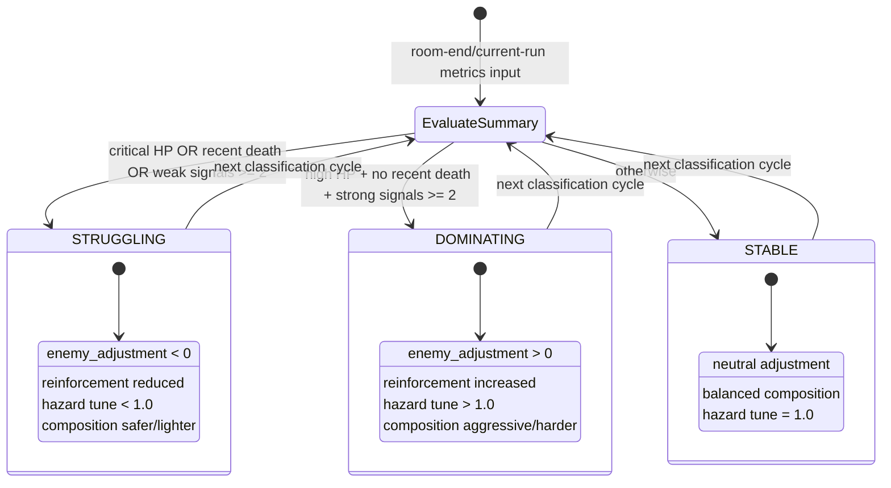

# AI Director Statechart

This statechart models how player performance classification drives AI Director outputs.

## Life-Phase Visibility Override

The final visible player state used by the director is constrained by life phase:

- Life 3 always forces `STRUGGLING`.
- Life 2 can only be `STABLE` or `STRUGGLING`.
- Life 1 allows `DOMINATING`, `STABLE`, or `STRUGGLING`.
