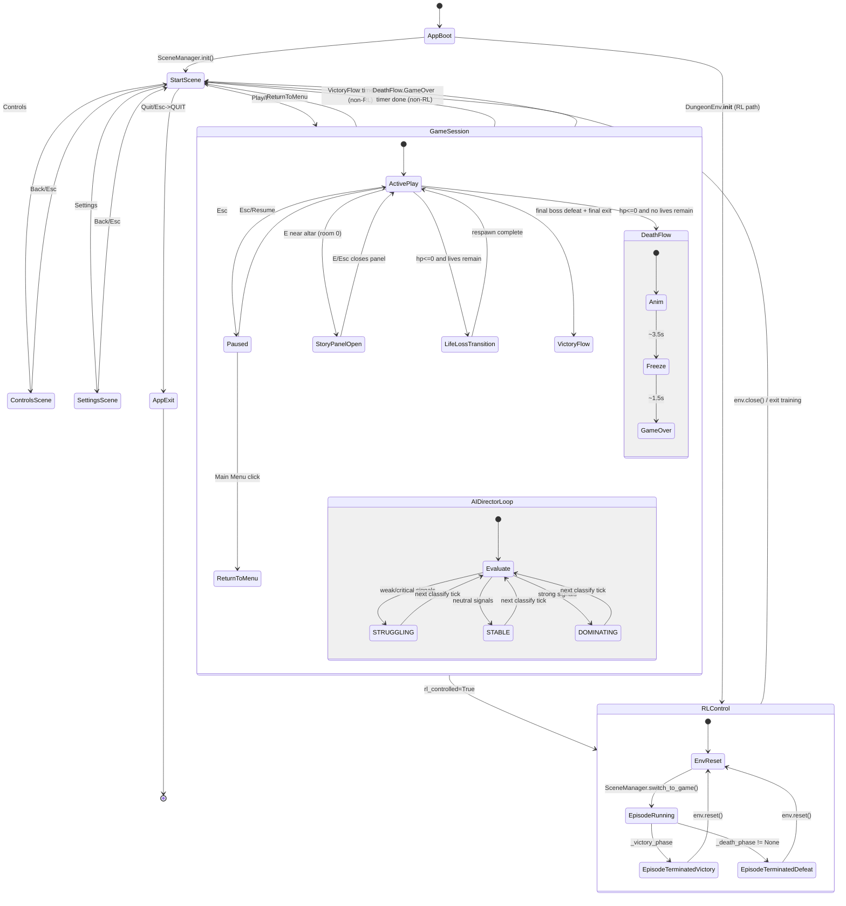

# Master System Statechart

This consolidated diagram summarizes how the main game loop, scene navigation, gameplay phases, AI adaptation, and RL control interact.

## Reading Guide

- `GameSession` captures regular player runtime states.
- `AIDirectorLoop` is continuous during active gameplay and updates director tuning from player model classification.
- `RLControl` overlays an alternate control loop where terminal states persist until `env.reset()`.
