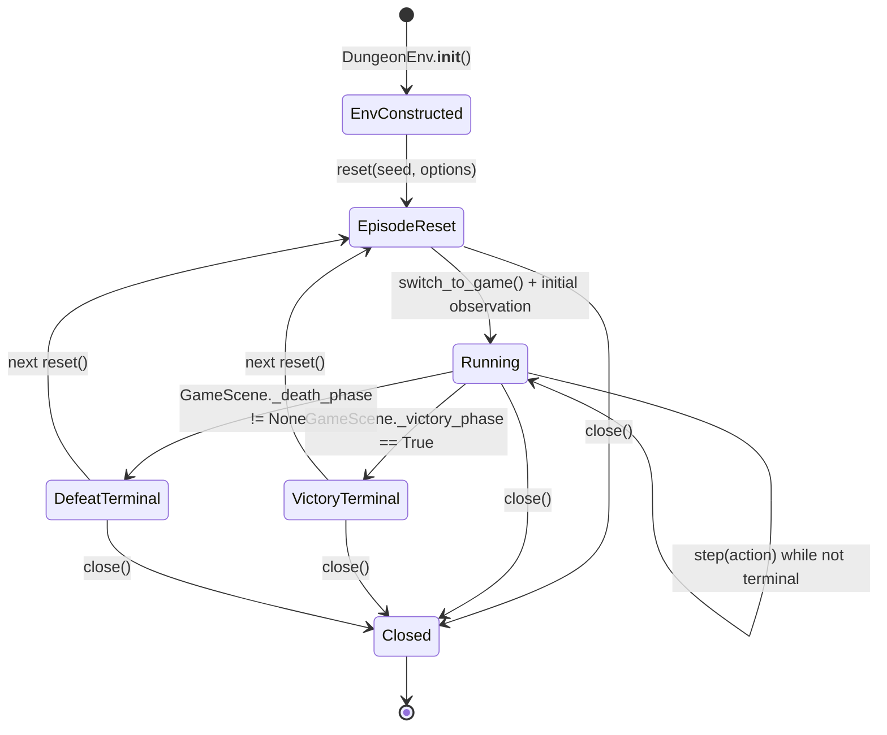

# RL Episode Statechart (Gymnasium)

## Transition Semantics

- `terminated=True` when victory or any death phase is active.
- `truncated=False` in `DungeonEnv.step()` (timeouts are wrapper-level when enabled).
- In RL-controlled mode, GameScene victory/defeat screens remain terminal until `env.reset()`.
