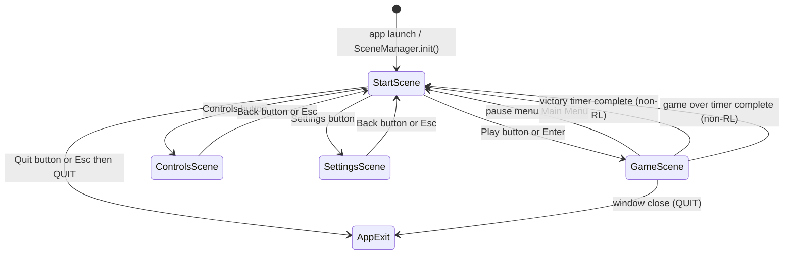
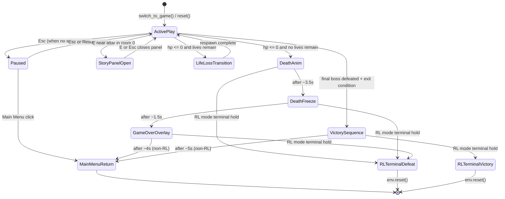

# Scene and Gameplay Statechart

## 1) SceneManager Navigation

```mermaid
stateDiagram-v2
    [*] --> StartScene: app launch / SceneManager.init()

    StartScene --> GameScene: Play button or Enter
    StartScene --> ControlsScene: Controls button
    StartScene --> SettingsScene: Settings button
    StartScene --> AppExit: Quit button or Esc then QUIT

    ControlsScene --> StartScene: Back button or Esc
    SettingsScene --> StartScene: Back button or Esc

    GameScene --> StartScene: pause menu Main Menu
    GameScene --> StartScene: victory timer complete (non-RL)
    GameScene --> StartScene: game over timer complete (non-RL)

    GameScene --> AppExit: window close (QUIT)
```

## 2) GameScene Runtime Statechart

```mermaid
stateDiagram-v2
    [*] --> ActivePlay: switch_to_game() / reset()

    ActivePlay --> Paused: Esc (when no story panel)
    Paused --> ActivePlay: Esc or Resume click
    Paused --> MainMenuReturn: Main Menu click
    MainMenuReturn --> [*]

    ActivePlay --> StoryPanelOpen: E near altar in room 0
    StoryPanelOpen --> ActivePlay: E or Esc closes panel

    ActivePlay --> LifeLossTransition: hp <= 0 and lives remain
    LifeLossTransition --> ActivePlay: respawn complete

    ActivePlay --> DeathAnim: hp <= 0 and no lives remain
    DeathAnim --> DeathFreeze: after ~3.5s
    DeathFreeze --> GameOverOverlay: after ~1.5s
    GameOverOverlay --> MainMenuReturn: after ~4s (non-RL)

    ActivePlay --> VictorySequence: final boss defeated + exit condition
    VictorySequence --> MainMenuReturn: after ~5s (non-RL)

    DeathAnim --> RLTerminalDefeat: RL mode terminal hold
    DeathFreeze --> RLTerminalDefeat: RL mode terminal hold
    GameOverOverlay --> RLTerminalDefeat: RL mode terminal hold
    VictorySequence --> RLTerminalVictory: RL mode terminal hold

    RLTerminalDefeat --> [*]: env.reset()
    RLTerminalVictory --> [*]: env.reset()
```
